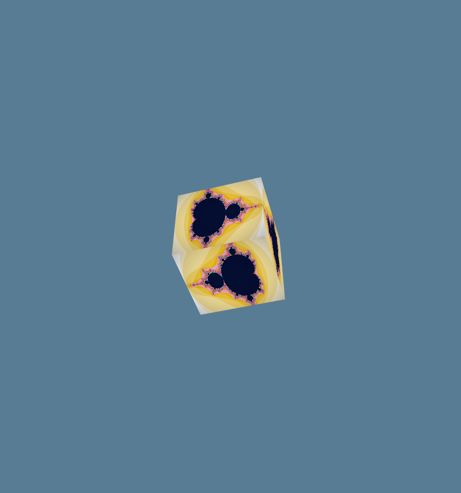

# Learning WGPU

## Overview
This project extends the cube.rs example from the [wgpu-rs](https://github.com/gfx-rs/wgpu-rs) repository in order to learn the basics of imgui, multiview rendering, and texture capture with wgpu

## How it works
The cube texture and mesh are rendered to 10 different multisampled textures, the UI chooses which texture to display to the window as well as the viewport in the UI window. The texture can be scaled and moved via push constants, the camera can be moved with the WASDQE keys, and a screenshot of the viewport can be taken with the C key.  

## Example:

